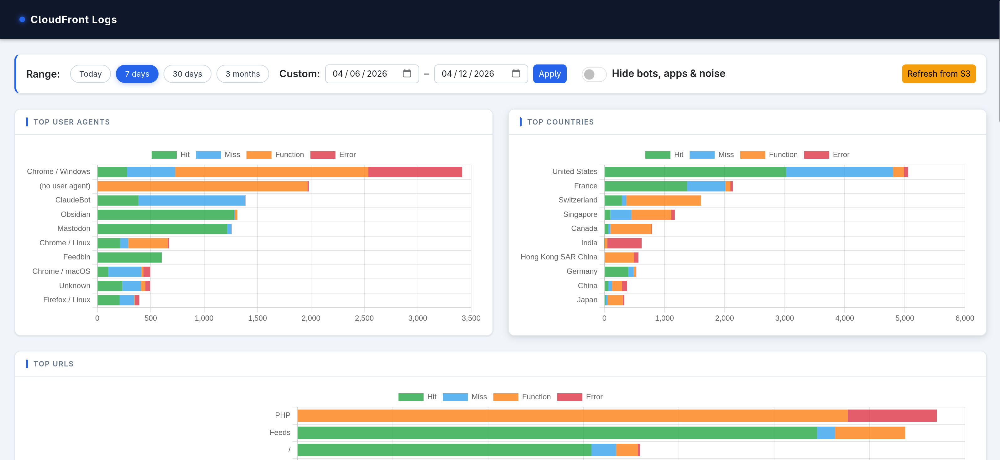

# analyze-logs

Spring Boot web dashboard for [Amazon CloudFront standard logs](https://docs.aws.amazon.com/AmazonCloudFront/latest/DeveloperGuide/AccessLogs.html) (JSON format).
Fetches log files from S3, stores them in a local SQLite database, and displays interactive charts with drill-down detail pages.



## Security notice

**This application is intended for local, single-user use only.**

- There is **no authentication or authorization**. Anyone who can reach port 8080 can view the dashboard and trigger S3 fetches.
- There is **no CSRF protection**. The application uses no Spring Security, so state-changing operations are not protected against cross-site request forgery. The `Refresh from S3` action uses a GET request to mitigate this for the one write-like operation, but the application should not be exposed to untrusted networks.

**Do not expose this application on a public interface or behind a shared reverse proxy without adding authentication (e.g. Spring Security with HTTP Basic, or an authenticating proxy such as nginx/Authelia).**

### Security controls in place

A security review found no exploitable vulnerabilities. The following controls are verified:

| Area | Control |
|------|---------|
| SQL injection | All database queries use `JdbcTemplate` with `?` bind parameters. User-supplied values are never interpolated into SQL strings. |
| XSS (server-side) | All Thymeleaf templates use `th:text` / `th:content` for user-controlled output, which applies automatic HTML entity escaping. `th:utext` is not used anywhere. |
| XSS (client-side) | API responses are rendered onto `<canvas>` via Chart.js. Canvas drawing APIs do not interpret HTML or JavaScript. `encodeURIComponent()` is applied to all user-derived values placed into URLs. |
| Path traversal | No file-serving endpoints with user-controlled paths exist. S3 object keys come from AWS API responses, not from user input. |
| Data exposure | API endpoints return only CloudFront access-log data, which is the application's stated purpose. No credentials or internal state are exposed. |

## Build & run

Requires Java 25 and Maven.

```bash
mvn package
java -jar target/analyze-logs-1.0-SNAPSHOT.jar --spring.profiles.active=local
```

Or without packaging:

```bash
mvn spring-boot:run -Dspring-boot.run.profiles=local
```

Open `http://localhost:8080`.

## Configuration

### `application.yml` (committed — safe defaults)

Key properties:

| Key | Default | Description |
|-----|---------|-------------|
| `app.aws.region` | `us-east-1` | AWS region of the S3 bucket |
| `app.aws.bucket` | `` | S3 bucket containing CloudFront logs |
| `app.aws.prefix` | `` | S3 key prefix (e.g. `AWSLogs/123456789/CloudFront/`) |
| `app.aws.profile` | `` | AWS credentials profile (`~/.aws/credentials`); empty = default chain |
| `app.db-path` | `logs.db` | SQLite file path (relative to working directory) |
| `server.port` | `8080` | HTTP port |
| `uri-stem-filter.excluded-extensions` | `.css`, `.js`, `.png`, … | File extensions excluded from all URL charts (static assets) |
| `referer-filter.self-referers` | `[]` | Referer prefixes to exclude from Top Referers (your own domain). Matched with and without trailing slash, and as a bare domain without scheme. |
| `referer-normalizer.rules` | Google, Bing, Yahoo, … | Rules to group referer URLs into a single label. Each rule has `label` and one of `domain` (exact), `domain-starts-with`, or `domain-ends-with`. |

### `application-local.yml` (gitignored — your secrets)

Create `src/main/resources/application-local.yml` to override values without touching the committed file:

```yaml
referer-filter:
  self-referers:
    - "https://your-site.example.com/"
    - "http://your-site.example.com/"

app:
  aws:
    bucket: "my-cloudfront-logs"
    prefix: "AWSLogs/123456789/CloudFront/"
    profile: "my-aws-profile"
  db-path: /absolute/path/to/logs.db
```

This file is listed in `.gitignore` and will never be committed. Activate it with `--spring.profiles.active=local`.

### User-agent classification rules

The `ua-classifier.rules` list in `application.yml` maps UA substrings to human-readable labels.
Rules are evaluated top-to-bottom; first match wins. Add entries to classify custom bots or internal tools:

```yaml
ua-classifier:
  rules:
    - pattern: "MyInternalBot"
      label: "Internal crawler"
```

## Dashboard

### Main dashboard

Six charts, all scoped to the selected date range:

| Chart | Description |
|-------|-------------|
| Top User Agents | Horizontal stacked bar — classified UA names by request count, coloured by edge result type. Click a bar to open the UA detail page. |
| Top Blocked Countries (403) | Horizontal bar — countries blocked with HTTP 403. Click a bar to open the country detail page. |
| Top Allowed URLs | Horizontal bar — most-requested paths with status < 400; static assets (`.css`, `.js`, images, etc.) excluded. |
| Top Blocked URLs | Horizontal bar — most-requested paths across all statuses; `.php` files grouped as **PHP**, `/wp-*` paths grouped as **Wordpress**. |
| Top Referers | Horizontal bar — most frequent `Referer` headers; self-referrals and null referers excluded. Known search engines and social sites (Google, Bing, Yahoo, DuckDuckGo, Qwant, Facebook, Babelio) are grouped under a single label. Configurable via `referer-normalizer.rules`. |
| Requests per Day | Stacked bar — daily breakdown by edge result type: Hit, Miss, Function, Redirect, Error. |

Date range presets: **Today / 7 days / 30 days / 3 months** or a custom date picker.

**Hide bots & apps** toggle removes traffic from the *AI Bots*, *Search Bots*, *Other Bots*, and *Apps* UA groups — as well as entries with no user agent — from all six charts simultaneously. State is persisted in `localStorage`.

**Refresh from S3** button triggers an incremental fetch (skips already-imported files).

### UA detail page

Opened by clicking a bar in **Top User Agents**. Shows charts scoped to a single classified user-agent:

| Chart | Description |
|-------|-------------|
| Result Types | Pie — edge result type breakdown for this UA |
| Countries | Pie — geographic distribution of requests |
| Top URLs | Horizontal stacked bar — most-requested paths for this UA, coloured by edge result type (PHP / WordPress grouping applied) |
| Requests per Day | Line — daily request trend by edge result type |

### Country detail page

Opened by clicking a bar in **Top Blocked Countries**. Shows charts scoped to a single country:

| Chart | Description |
|-------|-------------|
| Result Types | Pie — edge result type breakdown for this country |
| Top URLs | Horizontal stacked bar — most-requested paths from this country, coloured by edge result type (PHP / WordPress grouping applied) |
| Requests per Day | Line — daily request trend by edge result type |

## AWS credentials

No credentials are stored by this application. Authentication is delegated to the
[AWS SDK default credentials chain](https://docs.aws.amazon.com/sdk-for-java/latest/developer-guide/credentials-chain.html):

1. Environment variables — `AWS_ACCESS_KEY_ID` / `AWS_SECRET_ACCESS_KEY`
2. `~/.aws/credentials` — populated by `aws configure`
3. EC2/ECS instance profile

### Minimum required IAM permissions

```json
{
  "Effect": "Allow",
  "Action": ["s3:ListBucket", "s3:GetObject"],
  "Resource": [
    "arn:aws:s3:::my-cloudfront-logs",
    "arn:aws:s3:::my-cloudfront-logs/*"
  ]
}
```

## Database

Logs are stored in a SQLite file (`logs.db` by default, relative to the working directory).
Query it directly with any SQLite-compatible tool:

```bash
sqlite3 logs.db "SELECT ua_name, COUNT(*) FROM cloudfront_logs GROUP BY ua_name ORDER BY 2 DESC"
```

### Schema

```sql
cloudfront_logs (
    id                        INTEGER PRIMARY KEY,
    timestamp                 TEXT NOT NULL,   -- ISO-8601 UTC
    edge_location             TEXT,
    sc_bytes                  INTEGER,
    client_ip                 TEXT,
    method                    TEXT,
    uri_stem                  TEXT,
    status                    INTEGER,
    referer                   TEXT,
    user_agent                TEXT,
    edge_result_type          TEXT,
    protocol                  TEXT,
    cs_bytes                  INTEGER,
    time_taken                REAL,
    edge_response_result_type TEXT,
    protocol_version          TEXT,
    time_to_first_byte        REAL,
    edge_detailed_result_type TEXT,
    content_type              TEXT,
    content_length            INTEGER,
    country                   TEXT,            -- ISO 3166-1 alpha-2
    ua_name                   TEXT             -- classified user-agent label
)

fetched_files (
    s3_key     TEXT PRIMARY KEY,
    fetched_at TEXT
)
```